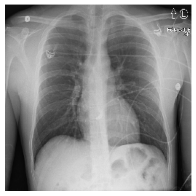
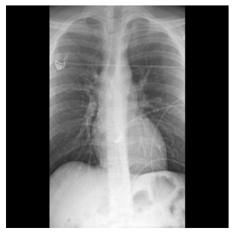
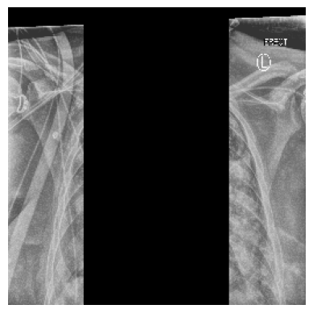
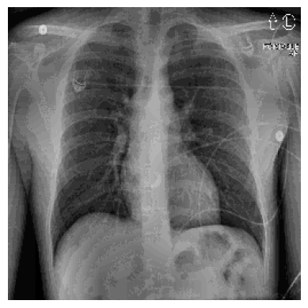
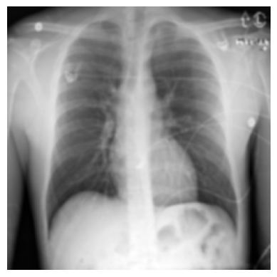
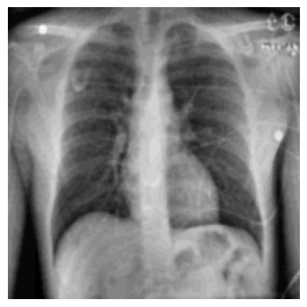

# Experiment Results 

This research focuses on analyzing regional characteristics of patients through Chest Radiographs (CR). The preprocessing stage is crucial, as it aims to ensure that the model captures physiological features associated with geographic locations rather than artifacts introduced during the image acquisition process. Below are some preprocessing recommendations designed to enhance the model's ability to learn patient-specific physiological traits effectively.

## Original Images (256*256)
- **Model:** ResNet50
- **Test Accuracy:** 0.9213
- **Epochs:** 5
- **Description:** The baseline performance on unaltered images.

## Block Left and Right Sides by 20%
- **Model:** ResNet50
- **Test Accuracy:** 0.8507
- **Epochs:** 5
- **Description:** Test accuracy after blocking 20% of the image from both the left and right sides.

## Block middle by 40%
- **Model:** ResNet50
- **Test Accuracy:** 0.8907
- **Epochs:** 4
- **Description:** Test accuracy after blocking middle by 40%.  

## Block middle by 90%
- **Model:** ResNet50
- **Test Accuracy:** 0.6293
- **Epochs:** 4
- **Description:** Test accuracy after blocking middle by 90%.  

## Block middle by 80%
- **Model:** ResNet50
- **Test Accuracy:** 0.7813
- **Epochs:** 4
- **Description:** Test accuracy after blocking middle by 80%.  

## CLAHE (Contrast Limited Adaptive Histogram Equalization)
- **Model:** ResNet50
- **Test Accuracy:** 0.8993
- **Epochs:** 4
- **Description:** Application of CLAHE to enhance image contrast before model inference.

## Gaussian Blur
- **Model:** ResNet50
- **Test Accuracy:** 0.8987
- **Epochs:** 4
- **Description:** Application of Gaussian blur filter on images before model inference.

## Combined CLAHE and Gaussian Blur
- **Model:** ResNet50
- **Test Accuracy:** 0.8973
- **Epochs:** 6
- **Description:** Combined application of CLAHE and Gaussian blur before model inference.

